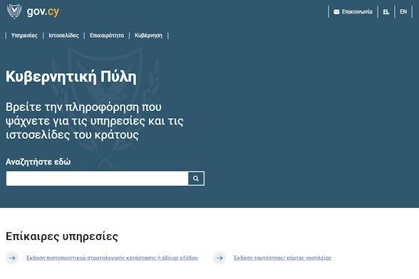
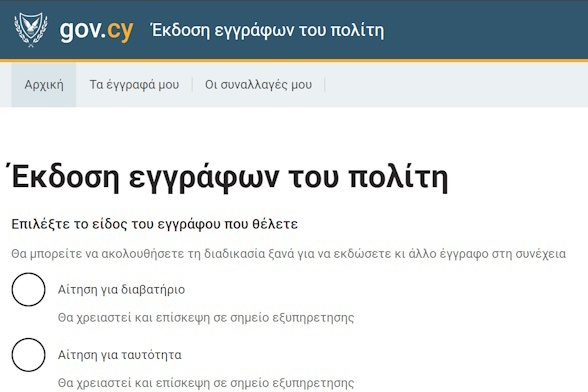

## What's new

**{{ site.dsUpdateDate }}**
Version 0.1.0 of the OOTS Integration Guide has been released.

<!-- [Read the full change log (opens in new tab)](https://github.com/gov-cy/govcy-design-system/blob/main/CHANGELOG.md){rel="noreferrer noopener" target="_blank"}. -->

<!-- 

## Overview
The Single Digital Gateway Regulation aims to digitize and simplify access to cross-border procedures across the European Union, thus helping citizens and businesses make the best of the Single Market. To implement this, the Once Only Technical System (OOTS) was conceptualised, to allow service providers to retrieve authenticated evidence about a user directly from the originating Member State. Consisting of multiple components (labelled as "building blocks"), the implementation of the OOTS seeks to largely abstract these building blocks behind a single Integration Layer, accessible via APIs.
These Integration APIs are intended to serve as an intermediary for Evidence Requesters and Evidence Providers - with core OOTS services.  

To get more information about the SDG Regulation and OOTS, first go through our [getting started guide](introduction/).

    

        

            

                <h2 class="govcy-pt-0">Styles</h2>
                
Make your service and website look like gov.cy with guides for applying layout &amp; grids, spacing, typography, colours and images.

                
<a href="./styles/index.html">Browse styles</a>

            

        

        

            

                <h2 class="govcy-pt-0">Components</h2>
                
Save time and keep the pages consistent with reusable, accesible components for forms, inputs, selections, panels, tables, navigations and more.

                
<a href="./components/index.html">Browse components</a>

            

        

        

            

                <h2 class="govcy-pt-0">Patterns</h2>
                
Help users with completing common tasks such as entering names and addresses, filling and applying for forms and account creation.

                
<a href="./patterns/index.html">Browse patterns</a>

            

        

    

<section class="govcy-my-5">
    

        <h2>In use</h2>
        

            

                

                    

                        
                    

                    
<a href="https://www.gov.cy" target="_blank">Portal - gov.cy</a>

                

            

            

                

                    

                        
                    

                    
<a href="https://citizen-documents.service.gov.cy/" target="_blank">Citizens documents service</a>

                

            

        

    

</section> -->