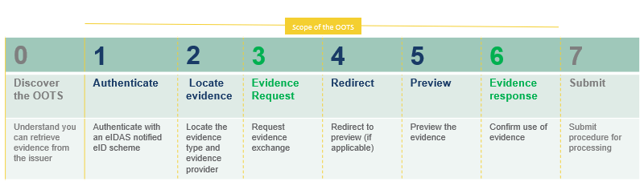

<!-- # CY OOTS Integration Guide -->

<!-- ## Introduction -->

## Single Digital Gateway Regulation (SDGR)
The **Single Digital Gateway Regulation (SDGR)** aims to digitize and simplify access to cross-border procedures across the European Union, thus helping citizens and businesses make the best of the Single Market. To implement this, the OOTS was conceptualized, to allow service providers to retrieve authenticated evidence about a user directly from the originating Member State. Consisting of multiple components (labelled as "building blocks"), this implementation of the OOTS seeks to largely abstract these building blocks behind a single Integration Layer, accessible via a REST API.  

**OOTS is the technical system for the cross-border automated exchange of evidence.**  The CY SDG OOTS Integration components are intended to serve as an intermediary - for Evidence Requesters (Procedure Portals) and Evidence Providers - with core OOTS services. This design allows integrators to connect with OOTS much more seamlessly, by abstracting the Evidence Exchange flow into API calls.

## Definitions
| Term              | Definition                              | Description                                                                     |
| ----------------- | --------------------------------------  | ------------------------------------------------------------------------------  |
| SDG | Single Digital Gateway | The regulation in which article 14 sets the requirement to establish a technical system for the automated exchange of evidence between competent authorities in different Member States |
| OOTS | Once Only Technical System | The technical system for the cross-border automated exchange of evidence |
| CA  | Competent authority | Competent authority means any Member State authority or body established at national, regional or local level with specific responsibilities relating to the information, procedures, assistance and services covered by the SDGR |
| TDD  | Technical Design Document| The Technical Design Document describes and provides additional technical detail to the OOTS Implementing Act |
| EP  | Evidence Provider| The competent authority which is providing the evidence |
| ER  | Evidence Requester| A webpage or a mobile application where a user can access and complete an online procedure |
| EB  | Evidence Broker| The Evidence Broker is an authoritative system that maps specific data sets as evidence types that prove specific requirements |
| DSD | Data Services Directory| The Data Service Directory is a common service that acts as a catalogue of evidence types that can be provided upon request |
| SR  | Semantic Repository| The Semantic Repository is a common service that acts as a data portal for the technical system |
| AP  | Access Point| The eDelivery Access Point implements a standardized message exchange protocol that ensures interoperable, secure and reliable data exchange |
| AS4  | AS4 Profile| The eDelivery AS4 Profile is a modular profile of the ebMS3 and AS4 OASIS specifications |

{.govcy-table}

## User Journey
<!--  -->

<!-- ### User Journey -->
The 7 key steps in the once only journey are presented on the diagram above.  The key steps are the following:

### Evidence Exchange with Preview
- Step 1: Authentication (eIDAS/CyLogin)  
- Step 2: Locate evidence type and evidence provider (Common Services)  
- Step 3: ER sends evidence request and EP responds with preview link 
- Step 4: ER redirects user to Preview Space and sends second request
- Step 5: User previews evidence on EP's Preview Space
- Step 6: User confirms the exchange and the EP send the response with the evidence to the ER
- Step 7: Submit the application in the ER's procedure portal

### User Journey Prototype (UX)
The user journey steps are demonstrated in the following figma prototypes:  
- **[Figma prototype 1](https://www.figma.com/proto/4SyUgc8mKqMBkyk96AFw2L/OOTS-user-journey?node-id=3406-6963&viewport=437%2C273%2C0.02&scaling=min-zoom&starting-point-node-id=3406%3A6963&show-proto-sidebar=1)**
- **[Figma prototype 2](https://www.figma.com/proto/4SyUgc8mKqMBkyk96AFw2L/OOTS-user-journey?page-id=16164%3A35647&node-id=9524-49289&viewport=681%2C895%2C0.02&t=30kRwBNTO5aJv3OP-1&scaling=min-zoom&starting-point-node-id=9524%3A49289)**

## Disclaimers
This document outlines the procedure necessary for online services or evidence providers to integrate into the Cyprus Single Digital Gateway. Therefore, the target audiences are the development teams and project managers engaged by the ERs and EPs, and organizations that are required to build services within the context of Annex II of the Single Digital Gateway Regulation.

### Audit Logs
It is the sole responsibility of the integrating party to maintain the logs and audit records of the electronic service, including logs of calls to the SDG Integration Layer. The integrating party shall not make reliance implicit or otherwise on any other logs.

## Reference Documents
- **[(OOP)(Guidance)(v5.00).pdf](../tdd/(OOP)(Guidance)(v5.00).pdf)**

